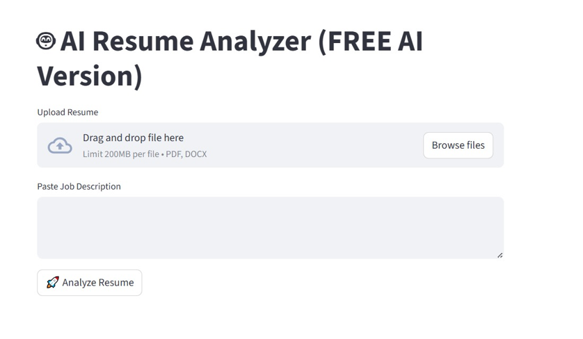
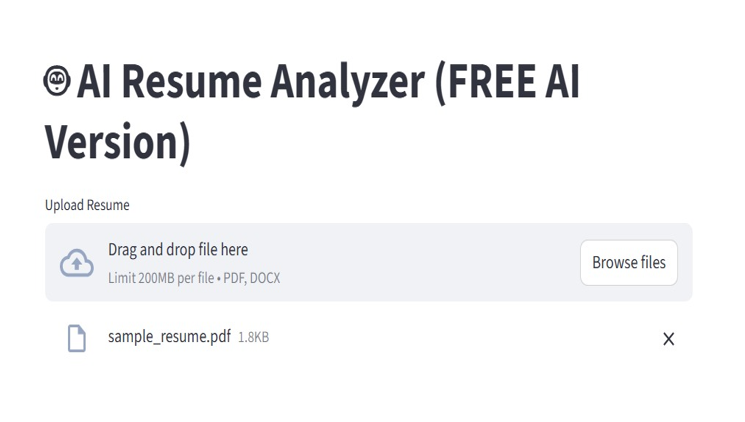
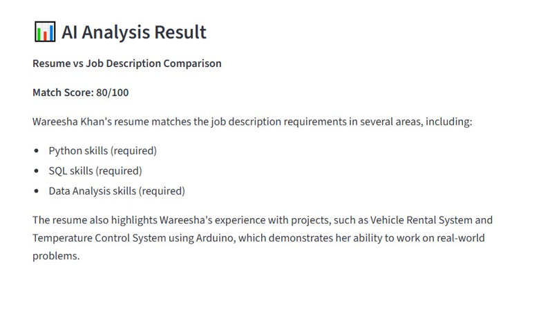
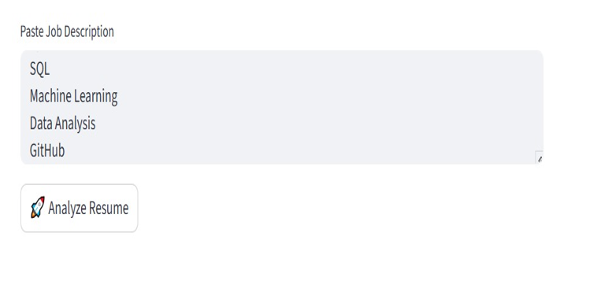
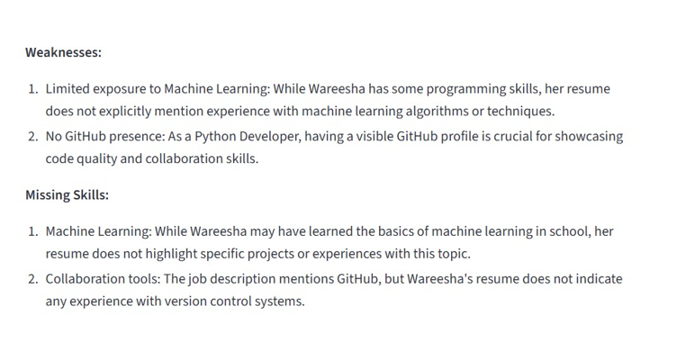
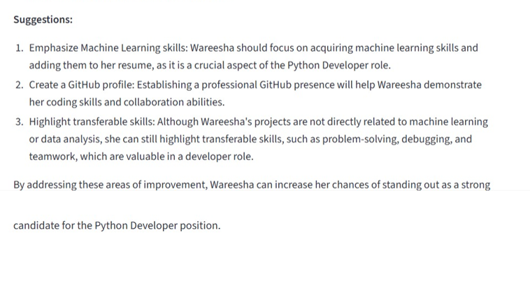

# AI Resume Analyzer

A beginner-friendly project built with **Python** and **Streamlit** that evaluates resumes against job descriptions. It extracts text from PDF/DOCX files, compares skills and keywords, and provides structured feedback on strengths, weaknesses, and areas for improvement.

## Features
- Resume text extraction (PDF/DOCX)
- Job description input and comparison
- AI-powered feedback on strengths and weaknesses
- Match scoring system (%)
- Suggestions for improvement
- Interactive Streamlit dashboard

## Tech Stack
- Python
- Streamlit
- PyPDF2 / python-docx
- Pandas
- OpenAI API (for NLP analysis)

## Installation
1. Clone the repository:
   ```bash
   git clone https://github.com/Maham-Arif7/AI-Resume-Analyzer.git

2.  Navigate to the project folder:
   cd AI-Resume-Analyzer

3. Install dependencies:
   pip install -r requirements.txt

##Usage
Run streamlit app:
  streamlit run app.py
  
Upload a resume and job description, then view the analysis and scoring results on the dashboard. 

##Project Structure
app.py → Main Streamlit application

resume_parser.py → Resume text extraction logic

analyzer.py → Keyword comparison and scoring

requirements.txt → Dependencies

description.txt → Project notes


##Future Enhancements
ATS compatibility checks

Advanced keyword weighting

Deployment on cloud platforms

Expanded analytics for resume formatting

##License
This project is open-source and available under the MIT License.


## Demo
Here’s what the app looks like when running:









